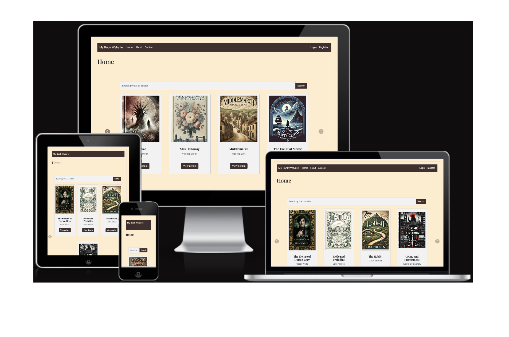
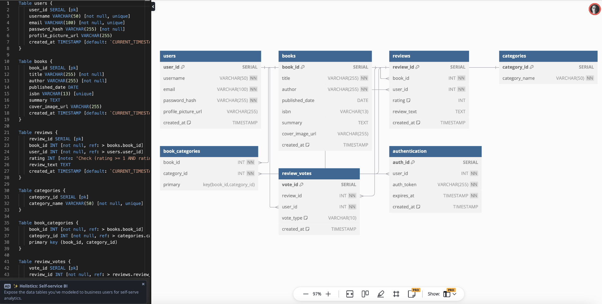
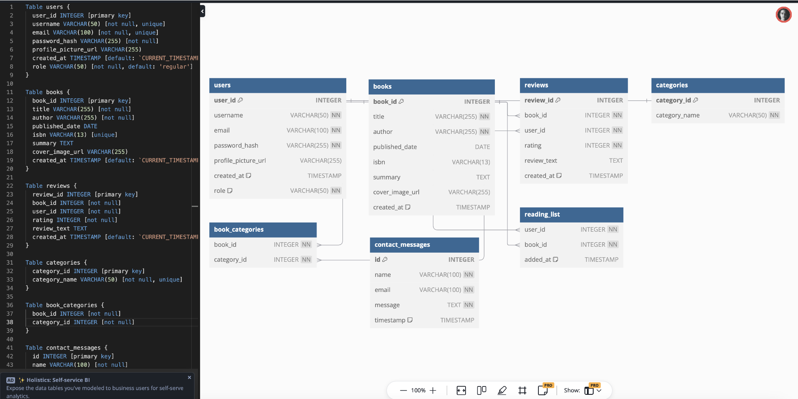
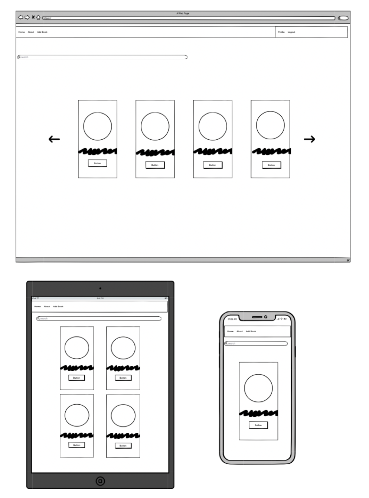

# CI3 Flask Books Application



Link to live project: [CI3 Flask Books](https://ci3-book-review-d8d5166064da.herokuapp.com)  
To register a new admin account, please sign up using an email that ends in @admin.com

## Table of Contents
- [Project Background & Summary](#project-background--summary)
- [User Experience (UX)](#user-experience-ux)
- [Features & Structure](#features--structure)
- [Design](#design)
- [Technologies Used](#technologies-used)
- [Testing](#testing)
- [Deployment](#deployment)
- [Credits](#credits)
- [References & Resources Used](#references--resources-used)

## Project Background & Summary
This project is a Flask-based book management system. The motivation behind this project was to provide a user-friendly application for managing books, tracking authors, and maintaining user records. It aims to merge the power of Flask as a Python micro-framework with a clean and intuitive frontend, making book management simple and efficient. The project does not leverage RESTful API architecture; The application demonstrates the ease of CRUD (Create, Read, Update, Delete) operations with Flask. However, DELETE operations are not supported by HTML directly, so these have to be simulated by using POST. DELETE functionality would only be available in a truly RESTful setup.

The project provides a simple interface where users can view, add, edit, or delete book records and associate them with authors. This is designed to be flexible enough for expansion and suitable for different types of users, from avid readers to book clubs.

The scope of the project changed slightly half way through. I had initially intended to have a voting system on the reviews, and to have a custom authentication system. This changed when I discovered Flask's native authentication module; I also replace the voting functionality with a personalised reading list on a personal profile page.

### The initial data model


### The final data model

N.B. the book_categories table is unused in the final codebase and was therefore removed from models.py

## User Experience (UX)
### User Stories
#### First Time Visitor Goals

|Goal   |Achieved?|
|-------|---------|
|As a First Time Visitor, I want to easily understand the purpose of the application and how to navigate through it.|The purpose of the app is clear and navigation is intuitive|
|As a First Time Visitor, I want to be able to search for books and see the details.|The search function is obvious on the home page and book details are clearly displayed|
|As a First Time Visitor, I want a simple way to add or manage books in the system.|There is a navbar link to 'Add Book' and an easy way to edit details of existing books|

#### Returning Visitor Goals
|Goal   |Achieved?|
|-------|---------|
|As a Returning Visitor, I want to easily find the books I have previously added.|Although you cannot search or filter by an 'added_by' field, you can search for specific titles/authors|
|As a Returning Visitor, I want to update or delete records with ease.|Book records and user profile can be updated; profile picture can be deleted; books can be removed from reading list; Books, reviews and contact messages can only be deleted by admins|
|As a Returning Visitor, I want to stay informed about any new updates to the platform.|There is currently no mechanism to do this|

#### Frequent Visitor Goals
|Goal   |Achieved?|
|-------|---------|
|As a Frequent Visitor, I want to see all book records displayed in an organized manner.|Books are displayed in a carousel with the goal of showing users new content. Specific records can be searched. A future feature could include different layout options|
|As a Frequent Visitor, I want to ensure that the system functions smoothly with all its features, including book and author management.|Frequent users can sign up for an admin account which gives access to more powerful data management tools|
|As a Frequent Visitor, I want to access the system without any technical errors or bugs.|Currently, everything runs smoothly|

## Features & Structure
### Existing Features
- **Homepage & Navigation**: The homepage provides users with a clean and simple interface, displaying the carousel of books and a search bar for easy access.
- **Book Listing**: Users can view books with details such as title, author, and publication year. Clicking on a book allows the user to view more detailed information.
- **Add/Edit/Delete Book**: Users can add new books and update the details of a book.
- **Author Management**: Manage author details and associate books with specific authors.
- **User Authentication**: Authentication ensures that only registered users can access full functionality, such as adding or editing book records.
- **Search Functionality**: A search bar allows users to quickly find books by title or author.

### Future Features
- Improve general styling. I'm aware that the styling leaves much to be desired, however with limited time, my focus was on the data and business logic.
- Improve reading list features like marking as read.
- Add 'forgotten password' feature
- Add email notifications for book updates or new entries.
- Allow users to delete their own books/reviews
- Allow searching/filtering by category
- Allow users to query on books they added themselves
- Allow different ways of displaying the catalogue of books (e.g. all books alphabetically, random carousel etc.)
- Hook up email functionality
- If the project were to grow any larger I would modularise the codebase

## Design
### Wireframes
The wireframes are designed to be simple, with a focus on usability. The layout is clean, ensuring users can easily navigate and manage entries.



### Colour Scheme
The application uses neutral colors, such as off-whites and browns, to maintain a classic and functional appearance, without unnecessary distractions.

## Technologies Used
### Languages
- Python (Flask framework)
- HTML5
- CSS3
- JavaScript (for frontend interactivity)

### Applications
- Git - for version control.
- GitHub - for version control and hosting.
- Visual Studio Code - for developing the project.

### Frameworks, Libraries & Tools
- Flask - The primary backend framework.
- Jinja2 - For templating in HTML.
- SQLite - for development and testing.
- PostgreSQL - for production database system.
- Bootstrap - For responsive and mobile-friendly design.

### Other Tech & VS Code Extensions
- [Flask Debug Toolbar](https://flask-debugtoolbar.readthedocs.io/) - for debugging and testing.
- [Prettier](https://prettier.io) - for code formatting.
- [Github Copilot](https://github.com/features/copilot) for debugging and efficient use of terminal

### Learning Resources
- [Flask Documentation](https://flask.palletsprojects.com/en/3.0.x/) - for backend guidance.
- [W3Schools](https://www.w3schools.com) - for frontend and design inspiration.
- [Stack Overflow](https://stackoverflow.com) - used extensively throughout the project. Too many articles to list individually.
- [Codecademy](https://www.codecademy.com) - the course on Flask was invaluable.

## Testing
Extensive manual testing has been carried out to ensure all CRUD operations, form validations, and database interactions work correctly.

### Features Testing
| Feature             | Test Case                               | Outcome                                     |
| ------------------- | --------------------------------------- | ------------------------------------------- |
| Book Search         | Search for a book by title or author    | Search results display correct entries      |
| Add New Book        | Add a new book to the collection        | Book is successfully added and displayed    |
| Edit Book Details   | Edit the details of an existing book    | Updates are saved and reflected immediately |
| Delete Book         | Delete a book from the reading list     | Book is successfully deleted                |
| Leave a message   | Submit a contact form                   | Form is submitted and msg can be viewed by admin     |
| Edit Profile | Edit personal details in profile page | details can be successfully changed |

### Browser Testing
| Browser             | Compatibility | Responsiveness | Issues   |
| ------------------- | ------------- | -------------- | -------- |
| Chrome              | Good          | Good           | None     |
| Firefox             | Good          | Good           | None     |
| Safari              | Good          | Good           | None     |
| Edge                | Good          | Good           | None     |

### Online Validation Services
- **HTML Validator**: Validated with no major errors (I have been unable to eradicate 1 error from the add_book page: The value of the for attribute of the label element must be the ID of a non-hidden form control.).
- **CSS Validator**: Passed with no significant issues (3 warnings I have chosen to ignore as insignificant).
- **Flask Debugging**: Used Flask's built-in debugger to resolve any backend issues.
- **PEP 8**: I used flake8 to format my python files according to PEP8 standards. I have exceeded the line length of 79 chars on a few considered occasions in app.py as strict adherence would have compromised readability.

## Deployment
The application is deployed on Heroku. 

Please feel free to clone the project and use it for your own site. In order to do this:

### Cloning the Repo
1. Open your terminal and run the following command to clone the repository:```git clone https://github.com/bizboz1981/CI3-flask-books```
2. cd into the new project directory: ```cd CI3-flask-books```
3. Create and activate a virtual environment: <br>```python3 -m venv venv```<br>```source venv/bin/activate``` (On Windows use `venv\Scripts\activate`)
4. Install the required dependencies from the requirements.txt file: ```pip install -r requirements.txt```
5. Create a .env file in the root directory and add the necessary environment variables: ```touch .env```
6. Add the following lines to the .env file: <br> ```SECRET_KEY=your_secret_key``` <br> ```SQLALCHEMY_DATABASE_URI=your_database_uri``` <br> ```HEROKU_API_KEY=your_heroku_key_here```

### Deploy to Heroku
1. Log in to your Heroku account using the Heroku CLI: ```heroku login```
2. Create a new Heroku app: ```heroku create your-app-name```
3. Add the Heroku Postgres add-on to your app: ```heroku addons:create heroku-postgresql:hobby-dev``` (depending on your subscription plan)
4. Set environment variables on Heroku:<br>```heroku config:set SECRET_KEY=your_secret_key```<br>```heroku config:set SQLALCHEMY_DATABASE_URI=your_database_uri```
5. Deploy the application to Heroku: ```git push heroku main```
6. Run the database migrations on Heroku: ```heroku run flask db upgrade```
7. Open the dployed application: ```heroku open```

I would like to thank my mentor Jack Wachira for his help and advice.